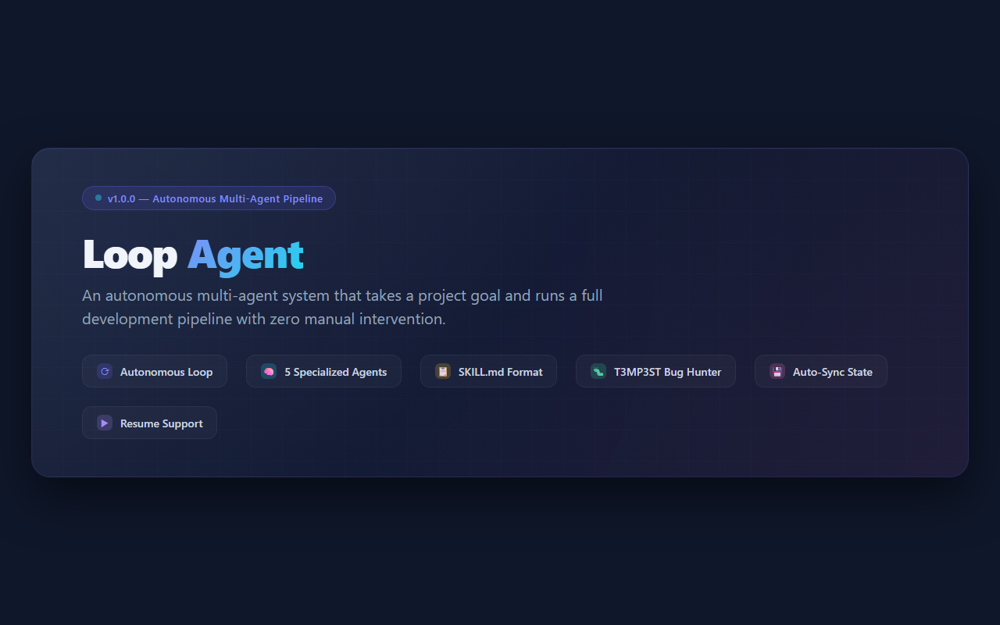
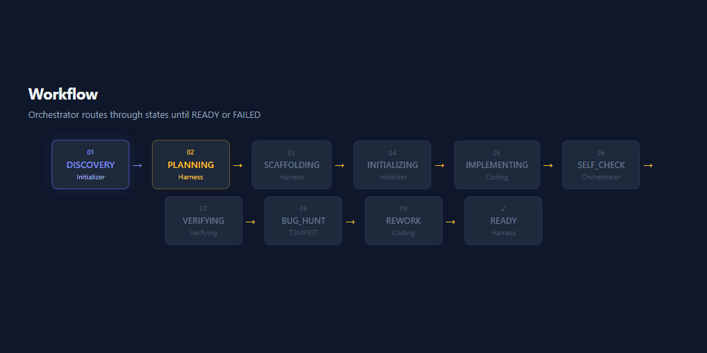
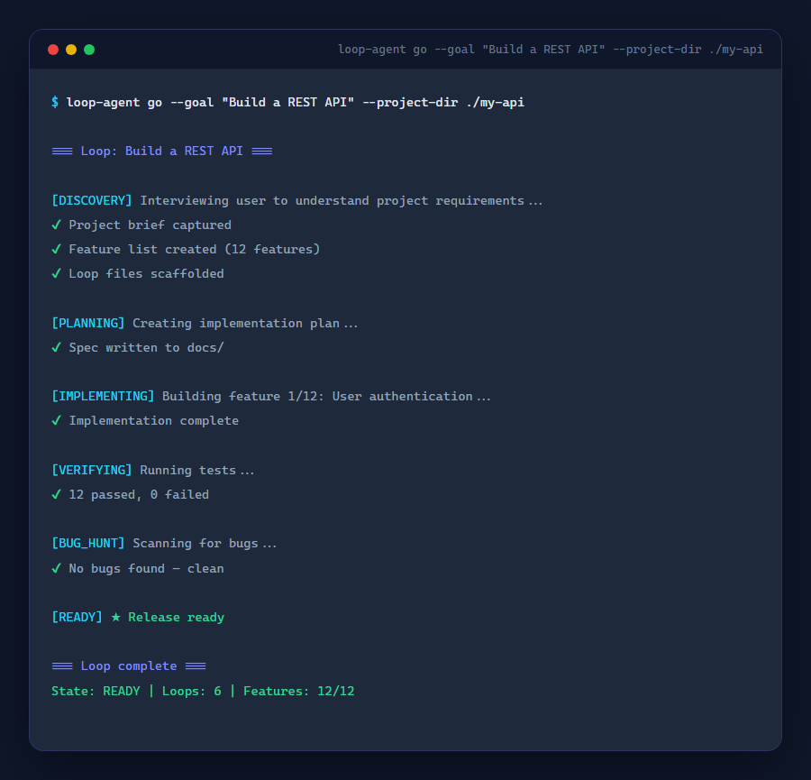
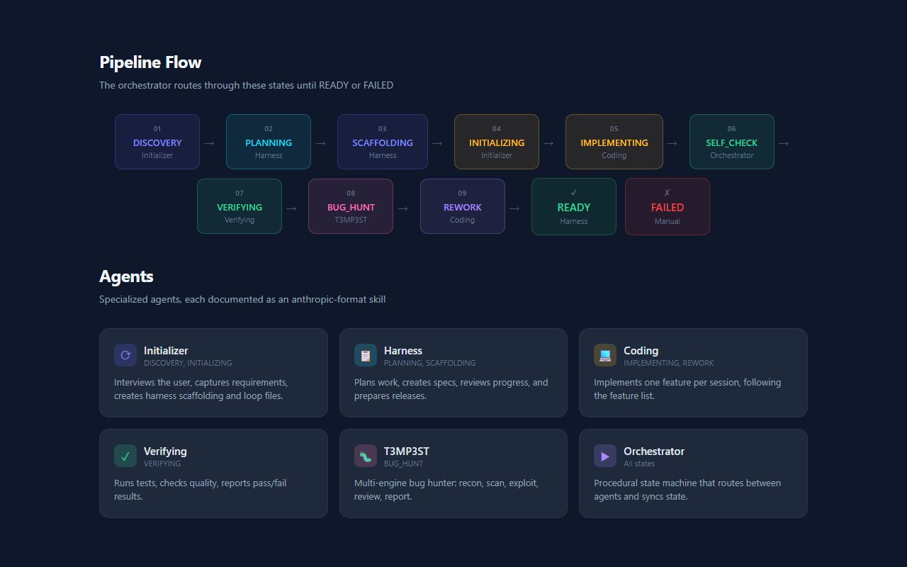

<p align="center">
  
</p>

<h1 align="center">Loop Agent</h1>

<p align="center">
  <strong>Autonomous multi-agent development pipeline. Give it a goal — it runs until it's done.</strong>
</p>

<p align="center">
  
  
  
</p>

---

## What is Loop Agent?

Loop Agent is a **fully autonomous multi-agent system** that takes a project goal and runs a complete development pipeline — from discovery to release — with **zero manual intervention**.

Give it a single goal like *"Build a REST API with auth"*, and it will:

1. **Interview** you to understand requirements
2. **Plan** the implementation step-by-step
3. **Scaffold** the project structure
4. **Implement** features one at a time
5. **Verify** everything works
6. **Hunt** for bugs automatically
7. **Release** when it's done

---

## How It Works

<p align="center">
  
</p>

The orchestrator routes through **11 states** until the project is ready:

```
DISCOVERY → PLANNING → SCAFFOLDING → INITIALIZING → IMPLEMENTING → SELF_CHECK → VERIFYING → BUG_HUNT → REWORK → READY
```

After every phase, all core files (AGENTS.md, state.md, tasks/, context.md) are **automatically synced** so the system never loses context.

---

## Features

| Feature | Description |
|---------|-------------|
| **Fully Autonomous** | Single command: `loop-agent go --goal "..."` — runs until DONE |
| **5 Specialized Agents** | Initializer, Harness, Coding, Verifying, T3MP3ST (bug hunter) |
| **Auto-Sync** | Core loop files updated after every phase change |
| **Resume Support** | Session persists to `.loop-session.json` — resume from where you left off |
| **Bug Hunting** | T3MP3ST agent runs 5-stage bug scan (recon, scan, exploit, review, report) |
| **Skill Format** | Each agent is documented as an anthropic-format SKILL.md |
| **State Persistence** | Markdown files track all state — human-readable, version-controllable |

---

## Quick Start

```bash
# 1. Install
git clone <repo-url> && cd loop-agent
uv sync

# 2. Run the autonomous loop
uv run loop-agent go --goal "Build a REST API with user auth and tests"

# 3. That's it — it runs until it's done
```

---

## Terminal Output

<p align="center">
  
</p>

---

## Agents

<p align="center">
  
</p>

### The 5 Agents

| Agent | States | Purpose |
|-------|--------|---------|
| **Initializer** | DISCOVERY, INITIALIZING | Interviews user, creates harness + loop files |
| **Harness** | PLANNING, SCAFFOLDING | Plans work, reviews progress, prepares releases |
| **Coding** | IMPLEMENTING, REWORK | Implements one feature per session |
| **Verifying** | VERIFYING | Runs tests, checks quality, reports pass/fail |
| **T3MP3ST** | BUG_HUNT | Multi-engine bug hunter (recon → scan → exploit → review → report) |

### Orchestrator

The **Orchestrator** is a procedural state machine that routes between agents. It's not an LLM agent — it's deterministic code that:

- Routes between states based on handler results
- Syncs core files after every phase
- Tracks goal and loops completed
- Supports resume from `.loop-session.json`

---

## Commands

```bash
# Full autonomous loop (single command)
loop-agent go --goal "Build a REST API" --project-dir ./my-api

# Interactive initialization only
loop-agent init --project-dir ./my-api

# Harness modes
loop-agent harness plan --project-dir ./my-api --goal "Scope the project"
loop-agent harness review --project-dir ./my-api
loop-agent harness release --project-dir ./my-api

# Single feature implementation
loop-agent coding --project-dir ./my-api --task-id "feature-1"

# Bug hunt only (static + dynamic + LLM review)
loop-agent hunt --project-dir ./my-api

# Autonomous loop (with max iteration safety limit)
loop-agent loop --goal "Build a REST API" --max-loops 10
```

---

## Skills

Each agent is documented as an **anthropic-format skill** under `skills/`:

```
skills/
  initializer/SKILL.md   — Interview + scaffold workflow
  harness/SKILL.md       — Plan / review / release modes
  coding/SKILL.md        — One feature per session
  verifying/SKILL.md     — Test runner + quality gate
  t3mp3st/SKILL.md       — Multi-engine bug hunting
  loop/SKILL.md          — Autonomous orchestrator
```

Validate skills:

```bash
skills-ref validate skills/*
```

---

## Core Files

After initialization, the project contains these loop-tracked files:

| File | Purpose |
|------|---------|
| `AGENTS.md` | Project instructions + agent run log |
| `loop-rules.md` | Global constitution for all agents |
| `LOOP.md` | Loop shape + state file locations |
| `context.md` | Project description + stack + commands |
| `state.md` | Current loop state + goals + log |
| `tasks/todo.md` | Task breakdown + feature tracking |
| `tasks/lessons.md` | Lessons learned from failures |
| `.loop-session.json` | Session persistence (resume support) |

All of these are **automatically synced** after every phase change — you never need to edit them manually.

---

## Development

```bash
# Install dependencies
uv sync

# Run tests
uv run pytest tests -v

# Validate skills
skills-ref validate skills/*

# Run the agent CLI
uv run loop-agent --help
```

### Project Structure

```
loop-agent/
  app/
    agents/
      initializer/   — InitializerAgent
      harness/       — HarnessAgent
      coding/        — CodingAgent
      verifying/     — VerifyingAgent
      t3mp3st/       — T3MP3STAgent (bug hunter)
      loop/          — Orchestrator
    session/         — Session persistence
    schemas/         — State machine + enums
    core_sync.py     — Auto-sync utility
    cli.py           — CLI entry point
  skills/            — Anthropic-format SKILL.md files
  assets/            — Visual assets (banner, terminal, workflow)
  tests/             — Integration tests
```

---

## License

MIT

---

<p align="center">
  Built with a lazy senior dev mentality — the shortest path to done is the right path.
</p>
